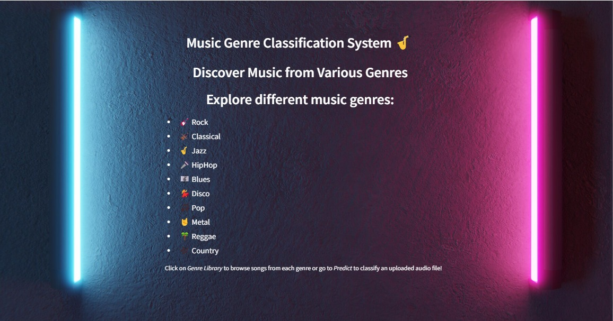
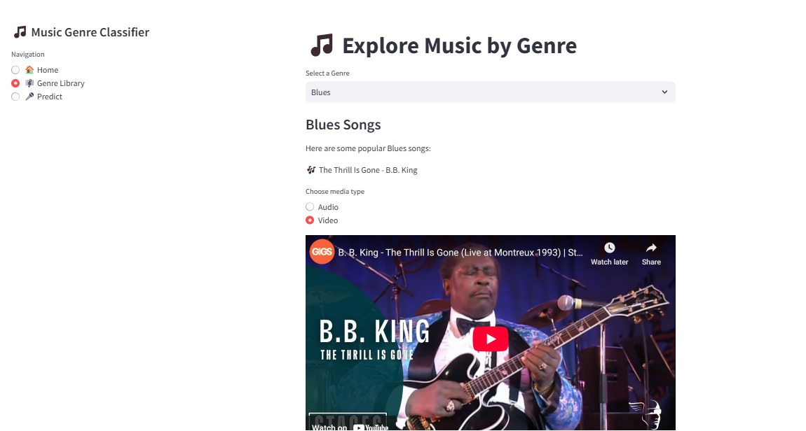
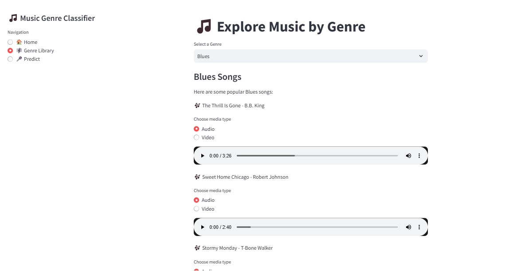
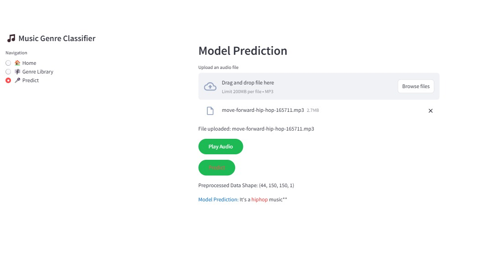

<div align="center">
<h1> Spectro🎼 </h1>
<h3>Discover Music from Various Genres!</h3>


</div>

## 🎶 About SpectroSync
SpectroSync is an immersive **music genre classification** application that allows users to **discover music** in different genres, listen to songs, watch videos, and even predict the genre of their uploaded music files. 

<div align='center'>
🎸 Rock | 🎻 Classical | 🎷 Jazz | 🎤 HipHop | 🎼 Blues | 💃 Disco | 🎵 Pop | 🤘 Metal | 🌴 Reggae | 🎶 Country
</div>
<br><br>

## ✨ **Features:**
- Browse through different music genres in the **Genre Library** 🎶
- Upload any music file to classify its **genre** 🔍
- Enjoy seamless music playback with **audio & video integration** 🎧
- Engaging and user-friendly **streamlit-based interface** 🎨

## 🖥️ Visuals
<div>  </div>

## Images
|||
|---|---|


|||
|---|---|

## 🚀 Installation
To set up and run `SpectroSync`, follow these steps:

### Prerequisites
- *Anaconda* (Jupyter Notebook) 📓
- *VSCode* (or any IDE of your choice) 🖥️
- *Python 3.7+* 🐍

```bash
# Clone the repository
 git clone https://github.com/your-username/SpectroSync.git

# Navigate to the project folder
 cd SpectroSync

# Install dependencies
 pip install -r requirements.txt
```

```bash
# Install Streamlit
pip install streamlit
```

>[!IMPORTANT]  
>Click on **[SpectroSync App](https://spectrosync-innov8.onrender.com/)** link to hop into our Application.

### 🌟 How to Use
1. *Run the app*:
   ```bash
   streamlit run app.py
   ```
2. *Navigate to the UI* (localhost link will be generated).
3. *Explore Genres*:
   - Click **Genre Library** to browse songs by category.
4. *Upload & Predict*:
   - Go to **Predict** section.
   - Upload an audio file (.wav, .mp3, etc.).
   - Get instant **genre prediction**!
5. *Enjoy the Music!* 🎧🎵

## 📌 Steps to Push Changes to GitHub
To contribute or update your repo, follow these steps:

```bash
# Initialize git repository (if not done already)
git init

# Add all changes
git add .

# Commit changes
git commit -m "Updated SpectroSync README"

# Set the remote repository (only for first-time setup)
git remote add origin https://github.com/your-username/SpectroSync.git

# Push changes to GitHub
git push origin main
```

>[!NOTE]  
>You can either use **Streamlit Cloud** or **Render Cloud** to deploy this app!

## 📞 Support
For any help, drop your query in our **chat room**, or email us at **22311a6677@aiml.sreenidhi.edu.in**

## ✨ Authors and Acknowledgments
- Manvitha Pola
- Tejaswi Arella
- K Venkata Sai Harini
  <br>
Special thanks to everyone who contributed to this project! 💙

